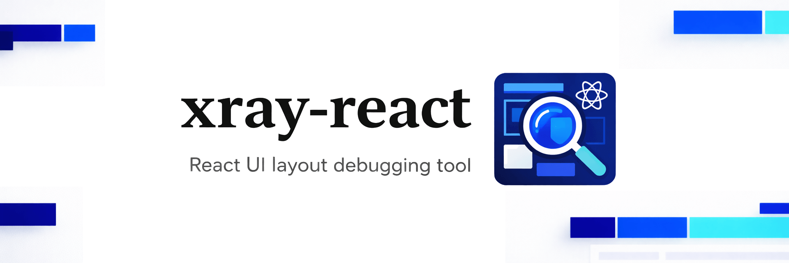

X-Ray React
==========

[](https://www.npmjs.com/package/xray-react)

React UI layout debugging tool inspired by [Xray-rails](https://github.com/brentd/xray-rails)

## Overview

Xray-react is a development tool that reveals your React UI's component structure. Press **Cmd+Shift+X** (Mac) or **Ctrl+Shift+X** (Windows/Linux) to reveal an overlay of the React components that rendered your UI, and click any component to open its source file in your editor.

### Full Mode (default)


### Simple Mode


## Features

- **React 18+ Support** - Works with React 18+ using React DevTools protocol, with fallback support for React <18
- **Multi-Bundler Support** - Works with Webpack and Vite
- **TypeScript Support** - Supports `.js`, `.jsx`, `.ts`, and `.tsx` files
- **Smart Component Filtering** - Automatically filters out external library components, showing only your project's components
- **Component Hierarchy Display** - Shows full component path from parent to child (e.g., `Page -> Layout -> Component`)
- **Modern UI** - Clean overlay interface with component search and scrollable component paths
- **Editor Integration** - Automatic detection for VSCode, WebStorm, Cursor, Sublime, and more
- **Fast & Lightweight** - Minimal performance impact

## Requirements

- **Node.js**: >= 22.0.0
- **React**: >= 16.0.0 (React 18+ recommended for best experience)

## Installation

```bash
npm install --save-dev xray-react
```

## Usage

### Webpack

```javascript
// webpack.config.js
import { XrayReactWebpackPlugin } from 'xray-react';

export default {
  // ... your config
  plugins: [
    // ... other plugins
    ...(process.env.NODE_ENV === 'development' ? [
      new XrayReactWebpackPlugin({
        output: 'bundle.js', // optional: specify output filename
        server: true, // optional: enable Socket.IO server (default: true)
        sourcePath: '/path/to/src', // optional: specify source path
        port: 9000, // optional: specify port (default: 8124)
        mode: 'full' // optional: 'full' or 'simple' (default: 'full')
      })
    ] : [])
  ]
};
```

**Legacy export (backward compatibility):**
```javascript
const { XrayReactPlugin } = require('xray-react');
// XrayReactPlugin is an alias for XrayReactWebpackPlugin
```

### Vite

```javascript
// vite.config.js
import { defineConfig } from 'vite';
import react from '@vitejs/plugin-react';
import { xrayReactVitePlugin } from 'xray-react';

export default defineConfig(({ mode }) => ({
  plugins: [
    react(),
    ...(mode === 'development' ? [
      xrayReactVitePlugin({
        server: true, // optional: enable Socket.IO server (default: true)
        sourcePath: '/path/to/src', // optional: specify source path
        port: 9000, // optional: specify port (default: 8124)
        mode: 'full' // optional: 'full' or 'simple' (default: 'full')
      })
    ] : [])
  ]
}));
```

### Next.js

For Next.js applications, you can use either the webpack plugin or manual imports.

#### Using Webpack Plugin

The webpack plugin automatically detects Next.js client builds and injects scripts into the appropriate chunks.

Configure xray-react in `next.config.js`:

```javascript
// next.config.js
import { XrayReactWebpackPlugin } from 'xray-react';

export default {
  webpack: (config, { dev, isServer }) => {
    if (dev && !isServer) {
      config.plugins.push(
        new XrayReactWebpackPlugin({
          server: true, // optional: enable Socket.IO server (default: true)
          sourcePath: process.cwd(), // optional: specify source path
          port: 9000, // optional: specify port (default: 8124)
          mode: 'full' // optional: 'full' or 'simple' (default: 'full')
        })
      );
    }
    return config;
  }
};
```

### Manual Import (Without Plugin)

If you're not using a bundler plugin, you can manually import the UI:

```javascript
// app/_app.tsx or your application entry point
import { useEffect } from 'react';

export default function App({ Component, pageProps }) {
  useEffect(() => {
    if (process.env.NODE_ENV === 'development') {
      import('xray-react/lib/xray-react-ui');
      import('xray-react/lib/xray-react-client'); // Optional: for file opening functionality
    }
  }, []);

  return <Component {...pageProps} />;
}
```

**Note:** When using manual import, the Socket.IO server won't be started automatically. You'll need to run the standalone server separately (see [Standalone Server](#standalone-server) below).

### Standalone Server

For manual imports or local development, you can run the xray-react server separately:

```bash
# From your React project root
cd /path/to/your/react-project

# Option 1: Set project root via environment variable
XRAY_REACT_PROJECT_ROOT=$(pwd) node node_modules/xray-react/server.js

# Option 2: Run from project root (auto-detects via package.json)
node node_modules/xray-react/server.js

# Option 3: If using npm link for local development
XRAY_REACT_PROJECT_ROOT=$(pwd) npm run server --prefix /path/to/xray-react
```

The server will:
- Auto-detect your project root (via `package.json` or `XRAY_REACT_PROJECT_ROOT` env var)
- Scan your source files to build component mappings
- Start Socket.IO server for file opening
- Send project configuration to connected clients

**Note:** The client bundle dynamically loads Socket.IO from a CDN, so an internet connection is required for file opening functionality.

## Configuration

### Environment Variables

Environment variables are primarily for **standalone server usage** or **global settings**. When using bundler plugins, plugin parameters take precedence.

- `XRAY_REACT_EDITOR` - Path or alias for your editor's executable file (truly global setting)
  ```bash
  export XRAY_REACT_EDITOR='subl' # Sublime Text
  export XRAY_REACT_EDITOR='code' # VSCode
  export XRAY_REACT_EDITOR='cursor' # Cursor
  export XRAY_REACT_EDITOR='webstorm' # WebStorm
  export XRAY_REACT_EDITOR='/Applications/Visual Studio Code.app/Contents/Resources/app/bin/code' # Full path
  ```

- `XRAY_REACT_PROJECT_ROOT` - Explicitly set the project root path (primarily for standalone server)
  ```bash
  export XRAY_REACT_PROJECT_ROOT='/path/to/your/react-project'
  ```

  **Note:** When using bundler plugins, this env var has lower precedence than plugin parameters.

- `XRAY_REACT_PORT` - Set the port for the Socket.IO server (primarily for standalone server, default: `8124`)
  ```bash
  export XRAY_REACT_PORT=9000
  ```
  
  **Note:** When using bundler plugins, this env var has lower precedence than plugin parameters. The port is automatically injected into the client bundle. For manual imports, you need to set `window.__XRAY_REACT_PORT__` before the client script loads.

- `XRAY_REACT_MODE` - Set the display mode (primarily for standalone server, default: `full`)
  ```bash
  export XRAY_REACT_MODE=simple  # or 'full'
  ```
  **Note:** When using bundler plugins, this env var has lower precedence than plugin parameters. See [Display Modes](#display-modes) for more information.

### Plugin Options

All plugins accept the following options:

- `output` (string, Webpack only) - Name of the output filename. Defaults to `'bundle.js'` or the first available asset.
- `server` (boolean) - Whether to run the Socket.IO server for handling file opening. Defaults to `true`.
- `sourcePath` (string) - Absolute path to your source files (e.g., `/home/user/project/src`). Takes precedence over auto-detection and env vars.
- `port` (number) - Port for the Socket.IO server. Takes precedence over `XRAY_REACT_PORT` env var. Defaults to `8124`.
- `mode` (string) - Display mode: `'full'` or `'simple'`. Takes precedence over `XRAY_REACT_MODE` env var. Defaults to `'full'`. See [Display Modes](#display-modes) for more information.

**Note:** All plugins automatically detect and skip server-side builds (SSR, Next.js server builds, etc.). The plugin only runs for client-side builds.

## Display Modes

xray-react supports two display modes:

### Full Mode (default)

In full mode, all component overlays are visible immediately when xray-react is activated. This is the traditional behavior where you can see all React components at once.

### Simple Mode

In simple mode, only the action bar is visible initially (the search component is hidden). Component overlays are shown only when you hover over their corresponding DOM elements. This provides a cleaner, less cluttered view and is useful when you want to inspect components one at a time.

- **Action bar**: Always visible at the bottom
- **Search component**: Hidden in simple mode
- **Component overlays**: Hidden by default, shown on hover
- **Screen border**: Thin blue border around the viewport to indicate xray-react is active

## Keyboard Shortcuts

- **Mac**: `Cmd+Shift+X`
- **Windows/Linux**: `Ctrl+Shift+X`
- **Esc**: Turn off the overlay (when active)

Press `Cmd+Shift+X` / `Ctrl+Shift+X` to toggle the xray-react overlay on/off. Press `Esc` to turn off the overlay when it's active.

## Supported File Types

- `.js` - JavaScript files
- `.jsx` - JSX files
- `.ts` - TypeScript files
- `.tsx` - TSX files

## Editor Support

The plugin automatically detects editors by checking common installation paths, then falls back to platform defaults:

- **VSCode** (`code`) - Detected from common paths or PATH
- **Cursor** (`cursor`) - Detected from common paths or PATH
- **WebStorm** (`webstorm`) - Detected from common paths or PATH
- **Sublime Text** (`subl`) - Detected from common paths or PATH
- **macOS default** (`open`) - Falls back if no editor detected
- **Windows default** (`start`) - Falls back if no editor detected
- **Linux default** (`xdg-open`) - Falls back if no editor detected

You can also specify a custom editor using the `XRAY_REACT_EDITOR` environment variable.

## Troubleshooting

### Components not showing

- Make sure you're using React 18+ or the plugin will fall back to legacy detection
- Check that your components are actually rendered in the DOM
- Verify that the plugin is only enabled in development mode
- Ensure source maps are enabled in your build configuration

### External components showing in path

- Verify that `XRAY_REACT_PROJECT_ROOT` is set correctly (if using standalone server)
- Check that your project root contains a `package.json` file
- Ensure source files are within the detected project root
- Verify that components have proper source maps in development mode

### Files not opening

- Ensure the `server` option is set to `true` (default) or run the standalone server
- Check that `XRAY_REACT_EDITOR` or another editor environment variable is set
- Check the browser console for Socket.IO connection errors
- For standalone server: ensure it's running and connected (check browser console)
- Ensure you have an internet connection (Socket.IO is loaded from CDN)

### Socket.IO connection errors

- Check that the server started successfully (look for server startup messages in console)
- Verify CORS settings if using a different origin
- For standalone server: ensure it's running before opening your app
- Check your internet connection (Socket.IO client is loaded from CDN)

### Duplicate component names opening wrong file

- This should be handled automatically
- If issues persist, check that component files are properly scanned (look for "Mapped X components" in server logs)
- Verify that component hierarchy is being detected correctly (hover over components to see full path)

### Project root not detected correctly

- Set `sourcePath` plugin parameter or `XRAY_REACT_PROJECT_ROOT` environment variable explicitly
- If using auto-detection: ensure `package.json` exists in your project root (only needed if neither `sourcePath` nor `XRAY_REACT_PROJECT_ROOT` is set)
- Check server logs for detected project root path
- For standalone server: run from your project root directory or set `XRAY_REACT_PROJECT_ROOT`

## Development

### Basic Commands

```bash
# Install dependencies
npm install

# Build the package
npm run build

# Run standalone server (for testing)
npm run server
```

### Local Development Setup

To test xray-react locally with another React project:

1. **Link the package:**
   ```bash
   # In xray-react directory
   npm link
   
   # In your React project
   npm link xray-react
   ```

2. **Run the standalone server:**
   ```bash
   # From your React project root
   XRAY_REACT_PROJECT_ROOT=$(pwd) npm run server --prefix /path/to/xray-react
   ```

3. **Rebuild after changes:**
   ```bash
   # In xray-react directory
   npm run build
   ```

   **Note:** The standalone server reads source files directly, so no rebuild is needed for server changes.

   **Note:** Rebuild is only needed if:
   - You're using webpack/vite plugins (they inject built files from `build/` directory)
   - You've made changes to UI or client code (`lib/xray-react-ui.js` or `lib/xray-react-client.js`)

## Contributing

Contributions are welcome! Please feel free to submit a Pull Request.

## License

MIT

## Credits

Inspired by [xray-rails](https://github.com/brentd/xray-rails) by [@brentd](https://github.com/brentd)
